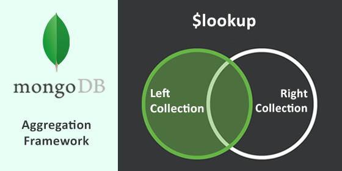
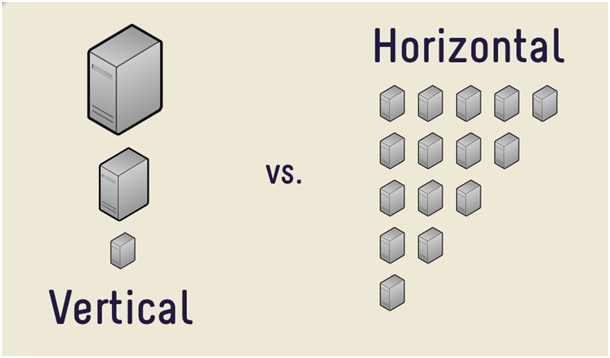

# 1. MongoDB nedir?
MongoDB document tabanlı, yüksek performans, yüksek kullanılabilirlik ve otomatik scaling sunan C++ ile yazılmış açık kaynak bir veritabanıdır.
## Document Data Type 
1. MongoDB verileri Document ([BSON](https://docs.mongodb.com/manual/reference/bson-types/) Binary JSON) formatında tutar. BSON JSON formatına çok benzerdir. 
    1. BSON'un avantajları:
        - Birçok programlama dilinde kullanılır.
        - Gömülü belgeler ve diziler join ihtiyacını azaltır.
        - Dinamik şema yapısını destekler.
# 2. Temel Özellikler       
## 1. Rich Query Language
1. Data Aggregation
1. Text Search
1. Geospatial (Coğrafi) Queries
## 2. High Availability
1. Otomatik yük dağılımı
1. Veri yedekleme
## 3. Yatay Genişleme
1. Sharding mimarisi ile veriyi cluster'lara dağıtma
1. Zone denilen bölgeleri oluşturma
## 4. Birden fazla Depolama Motorları desteği
1. WiredTiger Storage Engine
1. In-Memory Storage Engine
1. MMAPv1 Storage Engine
# 3. Detaylar
## 1. Rich Query Language
* [MLab](https://mlab.com/databases/mongotest) ile online mongodb oluşturulur.
* [Robomongo Studio 3T](https://studio3t.com/download-now/) indirilir.
* testdata.json import edilir.
### 1. [MongoDB Crud Operations](https://docs.mongodb.com/manual/crud/)
1. Insert:
    * insert: Bir veya birden çok kayıt ekler
    * insertOne: Bir kayıt ekler
    * insertMany: Birden çok kayıt ekler
    ```javascript
    db.artwork.insertOne(
    { item: "canvas", qty: 100, tags: ["cotton"], size: { h: 28, w: 35.5, uom: "cm" } }
    )
    ```
1. Query:
    * find: Query yapmamızı sağlar
    * ```db.inventory.find( {} )``` => ```SELECT * FROM inventory```
1. Update:   
    * updateOne: Bir kaydı günceller
    * updateMany: Birden çok kaydı günceller
    * replaceOne: _id field'ı dışındaki field'ları yeniden oluşturur, _id field'ı immutable (değiştirilemez) 'dır.
    ```javascript
    * update
    db.artwork.updateOne(
	{ _id: 2 },
	{
		$set: { status: "P" },
     	$currentDate: { lastModified: true }
	}
    )

    db.artwork.find({ _id: 2 })
    ```
    * replaceOne:
    ```javascript
    db.inventory.find({ item: "paper" })

    db.inventory.replaceOne(
    { item: "paper" },
    { item: "paper", instock: [ { warehouse: "A", qty: 60 }, { warehouse: "B", qty: 40 } ] }
    )

    db.inventory.find({ item: "paper" })
    ```
1. Delete:
    * delete: Bir veya birden çok kaydı siler
    * deleteOne: Bir kaydı siler
    * deleteMany: Birden çok kaydı siler
* [Retryable Writes](https://docs.mongodb.com/manual/core/retryable-writes/): MongoDB bir yazma işleminde network hatası oluşursa yazma işlemini tekrar deneyebilir.
### 2. [Text Search](https://docs.mongodb.com/manual/text-search/)
* Text Search yapabilmemiz için istediğimiz field'ları index'lememiz gerekir.
```javascript
db.stores.createIndex( { name: "text", description: "text" } )
```
* Arama index'lediğimiz tüm alanlarda gerçekleşir.
```javascript
db.stores.find( { $text: { $search: "coffee" } } )
```
* Or:
```javascript
// java, coffee veya shop olanlar
db.stores.find( { $text: { $search: "java coffee shop" } } )
```
* Exact:
```javascript
// Exact arama için kelime "" içine alınmalı
// java veya coffee shop olanlar
db.stores.find( { $text: { $search: "java \"coffee shop\"" } } )
```
* Term Exclusion:
```javascript
// java veya shop olan ama coffee olmayan
db.stores.find( { $text: { $search: "java shop -coffee" } } )
```
* Text Search Türkçe dahil pek çok dili destekler. [Diller](https://docs.mongodb.com/manual/reference/text-search-languages/)
### 3. Data Models
1. Döküman Yapısı
    MongoDB filexible schema özelliğine sahiptir yani aynı dökümanda bir kayıt bir kayıttan farklı olabilir. MongoDB'de 2 tür döküman yapısı bulunur.
    1. Reference 
        * Birden çok yazma işlemi gerektirir
    
    1. Embedded 
        * Atomic yazma işlemi yeterlidir
    
1. Schema Validation (3.6'dan sonra)
    * MongoDB update ve insert işleminden önce schema validation işlemini yapabilir.
    ```javascript
        db.createCollection("students", {
        validator: {
            $jsonSchema: {
                bsonType: "object",
                required: [ "name", "year", "major", "gpa"],
                properties: {
                    name: {
                        bsonType: "string",
                        description: "must be a string and is required"
                    },
                    gender: {
                        bsonType: "string",
                        description: "must be a string and is not required"
                    },
                    year: {
                        bsonType: "int",
                        minimum: 2017,
                        maximum: 3017,
                        exclusiveMaximum: false,
                        description: "must be an integer in [ 2017, 3017 ] and is required"
                    },
                    gpa: {
                        bsonType: [ "int" ],
                        description: "must be a integer and is required"
                    }
                }
            }
        }
        })
    ```
    ```javascript
    db.students.insert({
        name: "Alice",
        year: NumberInt(2019),
        major: "History",
        gpa: NumberLong(3)
    })
    ```
### 4. Aggregation
* Agrregation SQL karşılıkları için [link](https://docs.mongodb.com/manual/reference/sql-aggregation-comparison/).
* MongoDB'nin Aggregation işlemleri [Stage](https://docs.mongodb.com/manual/reference/operator/aggregation-pipeline/)'lerden oluşan "data processing pipeline" üzerine dayalıdır.

 Bir Collection stage'ler arasında taşınarak işlenir. Aggregation işlemlerinde Aggregation Pipeline operatörlerini de kullanabiliriz. [Operatörler](https://docs.mongodb.com/manual/reference/operator/aggregation/).
1. [$match](https://docs.mongodb.com/manual/reference/operator/aggregation/match/):
    ```javascript
    db.testdata.aggregate([ 
    { $match: { "zip": 90210 }}
    ])
    ```
    1. [$gte](https://docs.mongodb.com/manual/reference/operator/query/gte/#op._S_gte): >=
        ```cpp
        db.testdata.aggregate([ 
        {
        $match: {
            transactionDate: {
                $gte: ISODate("2017-01-01T00:00:00.000Z")
            }
        }
        }
        ]);
        ```
    1. [$lt](https://docs.mongodb.com/manual/reference/operator/query/lt/#op._S_lt): <
        ```cpp
        db.testdata.aggregate([ 
        {
        $match: {
            transactionDate: {
                $gte: ISODate("2017-01-01T00:00:00.000Z"),
                $lt: ISODate("2017-03-01T00:00:00.000Z")
            }
        }
        }
        ]);
        ```
1. [$group](https://docs.mongodb.com/manual/reference/operator/aggregation/group/#pipe._S_group):
    ```javascript
    db.testdata.aggregate([ 
    { $match: {"zip": 90210}}, 
    { 
        $group: {
        _id: null, 
        count: {
            $sum: 1
        }
        }
    }
    ]);
    ```
1. [$sort](https://docs.mongodb.com/manual/reference/operator/aggregation/sort/):
    ```javascript
    db.testdata.aggregate([ 
    { 
    $group : {_id : "$hosting", total : { $sum : 1 }}
    },
    { 
    $sort : {total : -1}
    }
    ]);
    ```
 1. [$addFields](https://docs.mongodb.com/manual/reference/operator/aggregation/addFields/):
    * Result'a yeni bir field ekler.
     ```javascript
    db.scores.aggregate( [
    {
        $addFields: {
        totalHomework: { $sum: "$homework" } ,
        totalQuiz: { $sum: "$quiz" }
        }
    },
    {
        $addFields: { totalScore:
        { $add: [ "$totalHomework", "$totalQuiz", "$extraCredit" ] } }
    }
    ])
    ```
1. [$unwind](https://docs.mongodb.com/manual/reference/operator/aggregation/unwind/):
    * Verideki array'i parçalayarak her bir değeri yeni bir satır olarak gösterir.
    ```javascript
    db.inventory.aggregate( [ { $unwind : "$sizes" } ] )
    ```
1. [$bucket](https://docs.mongodb.com/manual/reference/operator/aggregation/bucket/):   
    * Dökümanları expression'lara göre gruplara ayırır. 
    * *output* kısmında belirtilen her bucket bir döküman gibi ele alınır.
    * **$bucket** *groupBy* ifadesine göre dökümanları gruplama yaparak *_id* alanında bu değeri gösterir. *groupBy* ifadesinde göre işlenen bucket'lar *boundaries* (sınırlar) kısmında sınırları belirtilir.
    ```javascript
    db.artwork.aggregate( [
    {
        $bucket: {
        groupBy: "$price",
        boundaries: [ 0, 200, 400 ],
        default: "Other",
        output: {
            "count": { $sum: 1 },
            "titles" : { $push: "$title" }
        }
        }
    }
    ] )
    ```
1. [$facet](https://docs.mongodb.com/manual/reference/operator/aggregation/facet/): 
    * **$bucket** birden fazla bucket işlemini tek bir sorguda yapabilmemizi sağlar.
    ```javascript
    db.artwork.aggregate( [
    {
        $facet: {
        "categorizedByTags": [
            { $unwind: "$tags" },
            { $sortByCount: "$tags" }
        ],
        "categorizedByPrice": [
            // Filter out documents without a price e.g., _id: 7
            { $match: { price: { $exists: 1 } } },
            {
            $bucket: {
                groupBy: "$price",
                boundaries: [  0, 150, 200, 300, 400 ],
                default: "Other",
                output: {
                "count": { $sum: 1 },
                "titles": { $push: "$title" }
                }
            }
            }
        ],
        "categorizedByYears(Auto)": [
            {
            $bucketAuto: {
                groupBy: "$year",
                buckets: 4
            }
            }
        ]
        }
    }
    ])
    ```
1. [$graphLookup](https://docs.mongodb.com/manual/reference/operator/aggregation/graphLookup/):
    * Hiyerarşik yapıda tutulan veriyi denormalize (hiyerarşisi çözülmüş halde) şekilde gösterir.
    * Order ve Product ilişkisini gösteren örnek:
    ```javascript
    db.orders.aggregate([
   {
    $lookup:
        {
            from: "products",
            localField: "product_ids",
            foreignField : "_id",
            as: "ordered_product"
        }
    }
    ])
    ```
1. [$lookup](https://docs.mongodb.com/manual/reference/operator/aggregation/lookup/#pipe._S_lookup): 
    * Left Outer Join ilişkisi şeklinde çalışır.
    
    ```javascript
   db.orders.aggregate([
   {
      $unwind: "$product_ids"
   },
   {
    $lookup:
        {
            from: "products",
            localField: "product_ids",
            foreignField : "_id",
            as: "ordered_product"
        }
    }
    ])
    ```       
1. [$collStats](https://docs.mongodb.com/manual/reference/operator/aggregation/collStats/):
    * Bir collection veya view ile ilgili istatistikleri verir.
    ```javascript
    db.artwork.aggregate( [ { $collStats: { storageStats: { } } } ] )
    ```       
1. [$out](https://docs.mongodb.com/manual/reference/operator/aggregation/out/):
    * Oluşturulan sonucu ayrı bir dökümana yazar. Eğer o döküman varsa onu değiştirir.
    * Her zaman son stage olmalıdır.
    ```javascript
    db.books.aggregate( [
                      { $group : { _id : "$author", books: { $push: "$title" } } },
                      { $out : "authors" }
                  ] )
    ``` 
1. [$project](https://docs.mongodb.com/manual/reference/operator/aggregation/project/):
    * İstenilen field'ları bir sonraki stage'e taşır. Field'ların çıkarılması (exclude) veya içerilmesi (include) sağlanabilir.
    ```javascript
    // Include: Sadece Title ve Author
    db.books.aggregate( [ 
        { $project : { title : 1 , author : 1 } } 
        ] )
    ```
    ```javascript
    // Exclude: Title dışında herşey
    db.books.aggregate( [ 
        { $project : { title : 0} } 
        ] )
    ```  
1. [$redact](https://docs.mongodb.com/manual/reference/operator/aggregation/redact/):
    * İç içe olan dökümanlarda istenilen ifadeye göre kısıtlamalar yapar.
     ```javascript
     // Sadece STLW ve G olan olan iç dökümanlar listelenir diğerleri kısıtlanır.
    var userAccess = [ "STLW", "G" ];
    db.forecasts.aggregate(
    [
        { $match: { year: 2014 } },
        { $redact: {
            $cond: {
            if: { $gt: [ { $size: { $setIntersection: [ "$tags", userAccess ] } }, 0 ] },
            then: "$$DESCEND",
            else: "$$PRUNE"
            }
        }
        }
    ]
    );
    ```
    ```javascript
     db.accounts.aggregate(
    [
        { $match: { status: "A" } },
        {
        $redact: {
            $cond: {
            if: { $eq: [ "$level", 5 ] },
            then: "$$PRUNE", // budar
            else: "$$DESCEND"
            }
        }
        }
    ]
    );
    ```   
1. [$replaceRoot](https://docs.mongodb.com/manual/reference/operator/aggregation/replaceRoot/): 
    * Yeni kök dökümanın hangisi olduğunu belirler.
    ```javascript
    db.produce.aggregate( [
    {
        $replaceRoot: { newRoot: "$in_stock" }
    }
    ] )
    ```
### 4. [Map Reduce](https://docs.mongodb.com/manual/core/map-reduce/)   
MongoDB Map-Reduce işlemiyle JavaScript dilinde yazdığımız koda göre verileri getirir.  
1. Map: Key-Value şeklinde istenilen field'lar alınır.
2. Reduce: Alınan field'lar analitik işlemlere tabi tutularak filtrelenir.

* Map-Reduce işlemiyle sonuçları bir koleksiyona yazabiliriz.
* Dönen sonuç 16MB'dan büyük olmamalıdır.
    ```javascript
    // Map
    var mapFunction1 = function() {
                       emit(this.cust_id, this.price);
                   };

    // Reduce 
    var reduceFunction1 = function(keyCustId, valuesPrices) {
                          return Array.sum(valuesPrices);
                      };

    // Sonuç map_reduce_example dökümanına yazılır
    db.ordersmapreduce.mapReduce(
                     mapFunction1,
                     reduceFunction1,
                     { out: "map_reduce_example" }
                   )                                         
    ```
### 5. [Query Modifiers](https://docs.mongodb.com/manual/reference/operator/query-modifier/)
1. [$explain](https://docs.mongodb.com/manual/reference/operator/meta/explain/):      
    ```javascript
    db.artwork.find().explain()
    ```
1. [$hint](https://docs.mongodb.com/manual/reference/operator/meta/hint/): 
    * Query Optimizer için belirli bir field'ın kullanılmasını zorunlu kılar.    
   ```javascript
    db.users.find().hint( { age: 1 } )
    ``` 
1. [$maxScan](https://docs.mongodb.com/manual/reference/operator/meta/maxScan/) : 
    * Query'nin oluşturulmasında ne kadar dökümanın taranacağını kısıtlar.
### 5. [Sharding](https://docs.mongodb.com/manual/sharding/)    
* Sharding veriyi makineler üzerine dağıtma yöntemidir. 

Sistemi büyütmek için ya Vertical (dikey) Scaling ya da Horizontal (yatay) Scaling yapmamız gerekir. Sharding yatay genişlemede kullanılır.


* Bir Sharded Cluster şu bileşenleri taşır.
147
1. Shard: Her shard sharded data'nın bir alt kümesini taşır.
2. Mongos: Client application ve Cluster arasında olan Query router arayüzüdür.
3. Config Servers

// Todo: Sharding işlemleri